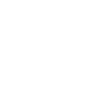

<div id="top"></div>

<!-- PROJECT SHIELDS -->
<!--
*** I'm using markdown "reference style" links for readability.
*** Reference links are enclosed in brackets [ ] instead of parentheses ( ).
*** See the bottom of this document for the declaration of the reference variables
*** for contributors-url, forks-url, etc. This is an optional, concise syntax you may use.
*** https://www.markdownguide.org/basic-syntax/#reference-style-links
-->

[![Contributors][contributors-shield]][contributors-url]
[![Forks][forks-shield]][forks-url]
[![Stargazers][stars-shield]][stars-url]
[![Issues][issues-shield]][issues-url]
[![MIT License][license-shield]][license-url]
[![LinkedIn][linkedin-shield]][linkedin-url]

<!-- PROJECT LOGO -->
<br />
<div align="center">
  <a href="https://github.com/vincentole/rustica_coffee_website">
    
  </a>

<h3 align="center">Rustica Coffee Website</h3>

  <p align="center">
    A responsible and interactive coffee shop website with integrated store and cart.
    <br />
    <br />
    <a href="https://github.com/vincentole/rustica_coffee_website"><strong>Explore the code »</strong></a>
    <br />
    <br />
    <a href="https://rustica-coffee-website.vercel.app/">View Demo</a>
    ·
    <a href="https://github.com/vincentole/rustica_coffee_website/issues">Report Bug</a>
    ·
  </p>
</div>

<!-- TABLE OF CONTENTS -->
<details>
  <summary>Table of Contents</summary>
  <br/>
  <ol>
    <li>
      <a href="#about-the-project">About The Project</a>
      <ul>
        <li><a href="#built-with">Built With</a></li>
        <li><a href="#what-i-learned">What I Learned</a></li>
        <li><a href="#what-i-learned">Roadmap & Continued Development</a></li>
      </ul>
    </li>
    <li>
      <a href="#getting-started">Getting Started</a>
      <ul>
        <li><a href="#installation">Installation</a></li>
        <li><a href="#usage">Usage</a></li>
      </ul>
    </li>
    <li><a href="#license">License</a></li>
    <li><a href="#contact">Contact</a></li>
    <li><a href="#acknowledgments">Acknowledgments</a></li>
  </ol>
</details>
<br />

<!-- ABOUT THE PROJECT -->

## About The Project

[![Rustica Coffee Website Screen Shot][product-screenshot]](https://rustica-coffee-website.vercel.app/)

Rustica Coffee Website is a website with integrated store. The coffee shop is imaginary and the project was created for learning purposes. The website has a contact form integrated with formspree and formik, a random products section, a store subpage (among others), as well as an interactive shopping cart.

<p align="right">(<a href="#top">back to top</a>)</p>

### Built With

-   [Next.js](https://nextjs.org/)
-   [React.js](https://reactjs.org/)
-   [Redux](https://redux.js.org/)
-   [Redux Toolkit](https://redux-toolkit.js.org/)
-   [TailwindCSS](https://tailwindcss.com/)
-   [headlessUI](https://headlessui.dev/)
-   [Formik](https://formik.org/)
-   [Formspree](https://formspree.io/)

<p align="right">(<a href="#top">back to top</a>)</p>

<!-- What I learned -->

### What I Learned

-   [] Feature 1
-   [] Feature 2
-   [] Feature 3
    -   [] Nested Feature

See the [open issues](https://github.com/vincentole/rustica_coffee_website/issues) for a full list of proposed features (and known issues).

<p align="right">(<a href="#top">back to top</a>)</p>

<!-- Roadmap & Continued Development -->

### Roadmap & Continued Development

-   [] Feature 1
-   [] Feature 2
-   [] Feature 3
    -   [] Nested Feature

Use this section to outline areas that you want to continue focusing on in future projects. These could be concepts you're still not completely comfortable with or techniques you found useful that you want to refine and perfect.

<p align="right">(<a href="#top">back to top</a>)</p>

<!-- GETTING STARTED -->

## Getting Started

To get a local copy up and running follow these simple example steps.

### Installation

1. Get a free formspree API Key at [https://formspree.io/](https://formspree.io/)
   <br/>
2. Clone the repo
   <br/>

    ```sh
    git clone https://github.com/vincentole/rustica_coffee_website.git
    ```

3. Install packages
   <br/>

    npm

    ```sh
    npm install
    ```

    yarn

    ```sh
    yarn
    ```

4. Enter your API in `.env.local`
   <br/>

    ```js
    FORMSPREE_POST_API = ENTER YOUR API
    ```

<p align="right">(<a href="#top">back to top</a>)</p>

<!-- USAGE EXAMPLES -->

### Usage

You can run the project in a local environment as follows:

npm

```sh
npm run dev
```

yarn

```sh
yarn dev
```

<p align="right">(<a href="#top">back to top</a>)</p>

<!-- LICENSE -->

## License

Distributed under the MIT License. See `github/LICENSE.md` for more information.

<p align="right">(<a href="#top">back to top</a>)</p>

<!-- CONTACT -->

## Contact

Ole Urfels (vincentole):

-   [@vincent_ole](https://twitter.com/@vincent_ole)
-   [LinkedIn](https://www.linkedin.com/in/ole-urfels/)

Project Link: [https://github.com/vincentole/rustica_coffee_website](https://github.com/vincentole/rustica_coffee_website)

<p align="right">(<a href="#top">back to top</a>)</p>

<!-- ACKNOWLEDGMENTS -->

## Acknowledgments

-   [opencampus.sh](https://www.opencampus.sh/)

<p align="right">(<a href="#top">back to top</a>)</p>

<!-- MARKDOWN LINKS & IMAGES -->
<!-- https://www.markdownguide.org/basic-syntax/#reference-style-links -->

[contributors-shield]: https://img.shields.io/github/contributors/vincentole/rustica_coffee_website.svg?style=for-the-badge
[contributors-url]: https://github.com/vincentole/rustica_coffee_website/graphs/contributors
[forks-shield]: https://img.shields.io/github/forks/vincentole/rustica_coffee_website.svg?style=for-the-badge
[forks-url]: https://github.com/vincentole/rustica_coffee_website/network/members
[stars-shield]: https://img.shields.io/github/stars/vincentole/rustica_coffee_website.svg?style=for-the-badge
[stars-url]: https://github.com/vincentole/rustica_coffee_website/stargazers
[issues-shield]: https://img.shields.io/github/issues/vincentole/rustica_coffee_website.svg?style=for-the-badge
[issues-url]: https://github.com/vincentole/rustica_coffee_website/issues
[license-shield]: https://img.shields.io/github/license/vincentole/rustica_coffee_website.svg?style=for-the-badge
[license-url]: https://github.com/vincentole/rustica_coffee_website/blob/master/LICENSE.txt
[linkedin-shield]: https://img.shields.io/badge/-LinkedIn-black.svg?style=for-the-badge&logo=linkedin&colorB=555
[linkedin-url]: https://linkedin.com/in/ole-urfels
[product-screenshot]: github/preview.png
